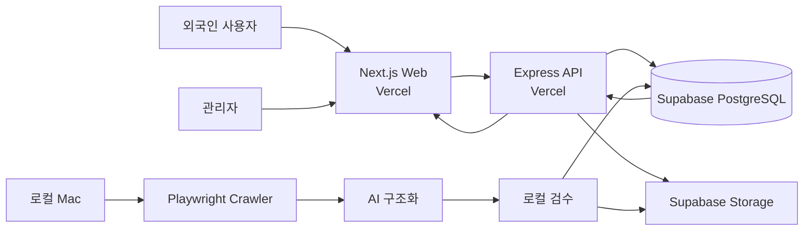
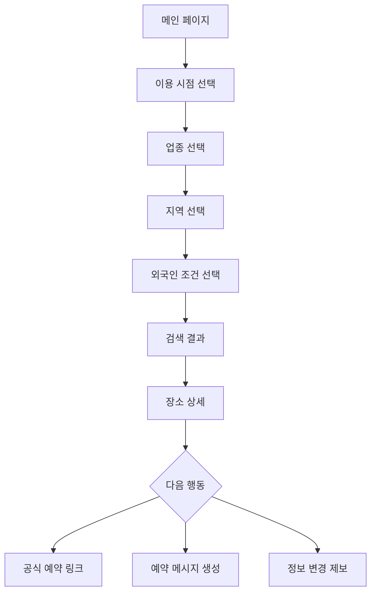
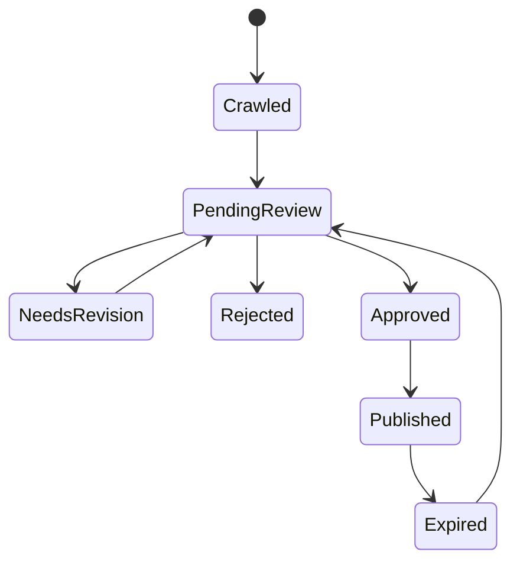
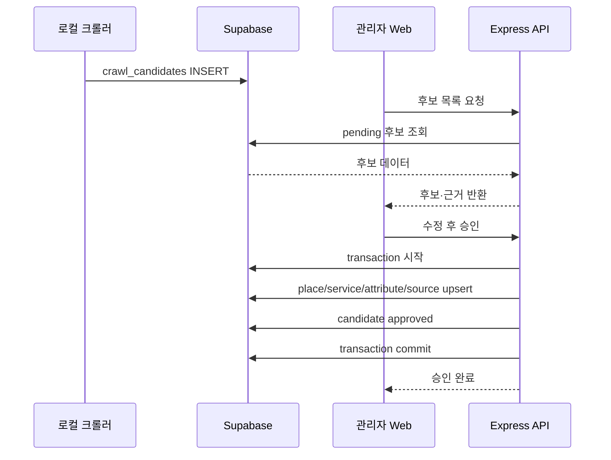
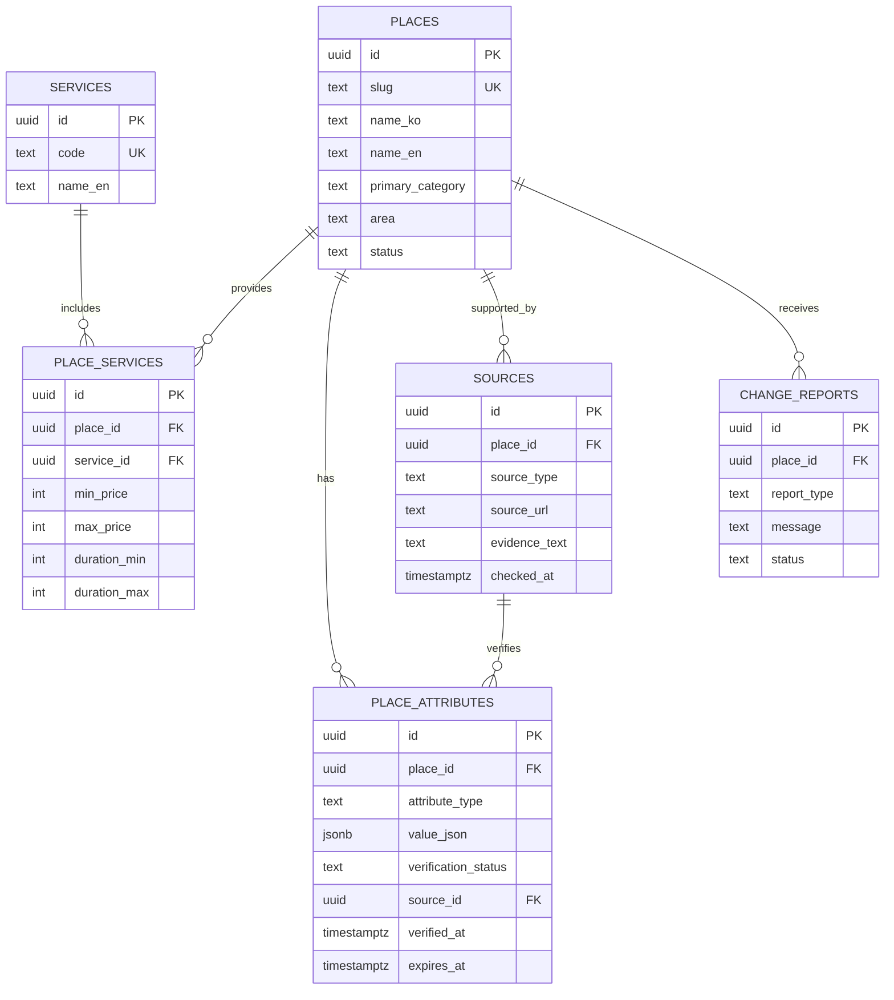
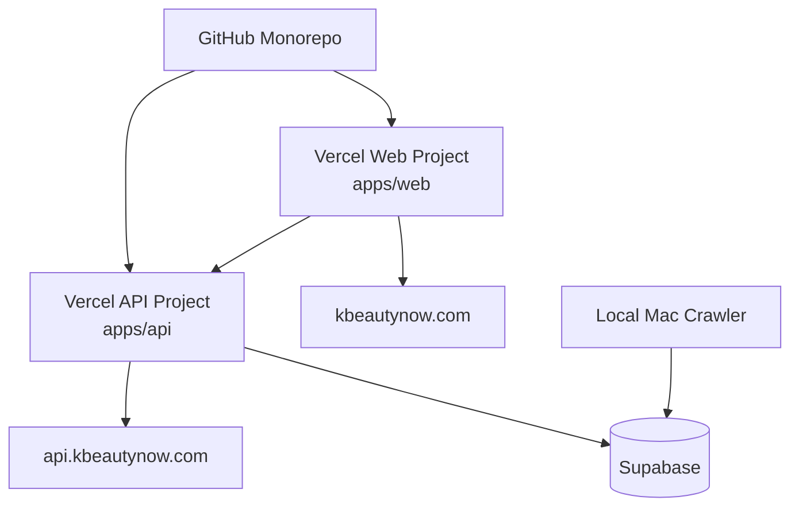

# 시스템 구상도

## 1. 전체 시스템

```mermaid
flowchart LR
    U[외국인 사용자] --> W[Next.js Web\nVercel]
    A[관리자] --> W
    W --> API[Express API\nVercel]
    API --> DB[(Supabase PostgreSQL)]
    API --> ST[Supabase Storage]

    M[로컬 Mac] --> C[Playwright Crawler]
    C --> X[AI 구조화]
    X --> V[로컬 검수]
    V --> DB
    V --> ST

    DB --> API
    API --> W
```

## 2. 사용자 검색 흐름

```mermaid
flowchart TD
    H[메인 페이지] --> T[이용 시점 선택]
    T --> C[업종 선택]
    C --> R[지역 선택]
    R --> F[외국인 조건 선택]
    F --> S[검색 결과]
    S --> D[장소 상세]
    D --> B{다음 행동}
    B --> L[공식 예약 링크]
    B --> M[예약 메시지 생성]
    B --> P[정보 변경 제보]
```

## 3. 데이터 검수 흐름

```mermaid
stateDiagram-v2
    [*] --> Crawled
    Crawled --> PendingReview
    PendingReview --> NeedsRevision
    NeedsRevision --> PendingReview
    PendingReview --> Rejected
    PendingReview --> Approved
    Approved --> Published
    Published --> Expired
    Expired --> PendingReview
```

## 4. 후보 승인 시퀀스

```mermaid
sequenceDiagram
    participant Local as 로컬 크롤러
    participant DB as Supabase
    participant Admin as 관리자 Web
    participant API as Express API

    Local->>DB: crawl_candidates INSERT
    Admin->>API: 후보 목록 요청
    API->>DB: pending 후보 조회
    DB-->>API: 후보 데이터
    API-->>Admin: 후보·근거 반환
    Admin->>API: 수정 후 승인
    API->>DB: transaction 시작
    API->>DB: place/service/attribute/source upsert
    API->>DB: candidate approved
    API->>DB: transaction commit
    API-->>Admin: 승인 완료
```

## 5. 핵심 ERD

```mermaid
erDiagram
    PLACES ||--o{ PLACE_SERVICES : provides
    SERVICES ||--o{ PLACE_SERVICES : includes
    PLACES ||--o{ PLACE_ATTRIBUTES : has
    PLACES ||--o{ SOURCES : supported_by
    SOURCES ||--o{ PLACE_ATTRIBUTES : verifies
    PLACES ||--o{ CHANGE_REPORTS : receives

    PLACES {
      uuid id PK
      text slug UK
      text name_ko
      text name_en
      text primary_category
      text area
      text status
    }

    SERVICES {
      uuid id PK
      text code UK
      text name_en
    }

    PLACE_SERVICES {
      uuid id PK
      uuid place_id FK
      uuid service_id FK
      int min_price
      int max_price
      int duration_min
      int duration_max
    }

    PLACE_ATTRIBUTES {
      uuid id PK
      uuid place_id FK
      text attribute_type
      jsonb value_json
      text verification_status
      uuid source_id FK
      timestamptz verified_at
      timestamptz expires_at
    }

    SOURCES {
      uuid id PK
      uuid place_id FK
      text source_type
      text source_url
      text evidence_text
      timestamptz checked_at
    }

    CHANGE_REPORTS {
      uuid id PK
      uuid place_id FK
      text report_type
      text message
      text status
    }
```

## 6. 배포 구상도

```mermaid
flowchart TB
    GH[GitHub Monorepo]
    GH --> VW[Vercel Web Project\napps/web]
    GH --> VA[Vercel API Project\napps/api]

    VW --> DOMAIN[kbeautynow.com]
    VA --> APIDOMAIN[api.kbeautynow.com]

    VW --> VA
    VA --> SUPA[(Supabase)]
    LOCAL[Local Mac Crawler] --> SUPA
```
